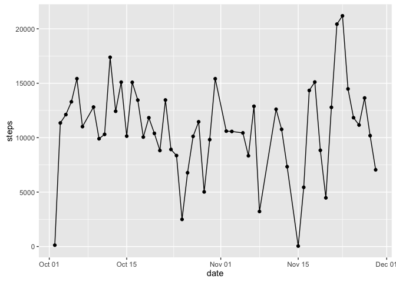
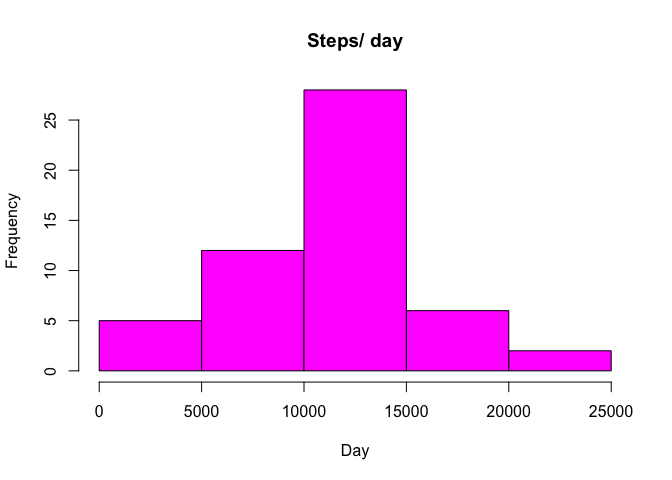
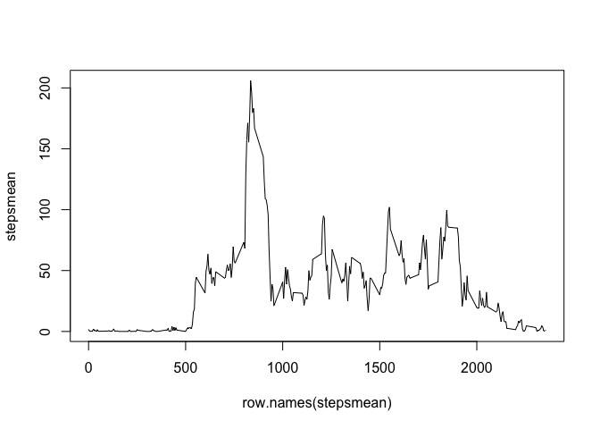
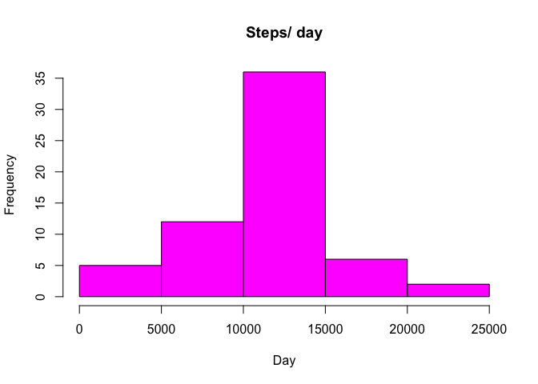
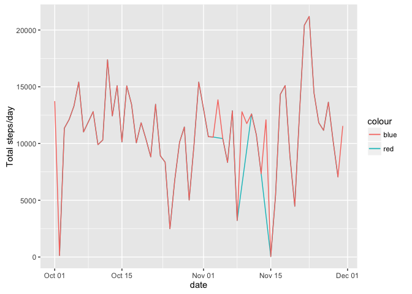
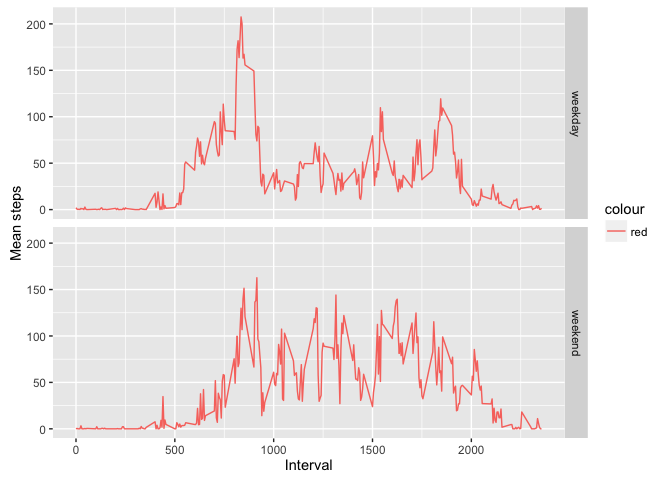

# Reproducible Research: assignment 2
Juan Luis Cabrera  
May 22, 2016  


## R Markdown

I. Loading and preprocessing the data

 1. Load the data 


```r
activity <- read.csv("activity.csv", stringsAsFactors = FALSE)
```

 2. Process/transform the data (if necessary) into a format suitable for your analysis

Convert date to Date/Time classes


```r
activity$date <- as.Date(activity$date, format="%Y-%m-%d")
```


II. What is mean total number of steps taken per day? For this part of the assignment, you can ignore the missing values in the dataset.
 1. Calculate the total number of steps taken per day. 


```r
stepssum <- aggregate(steps~date, data=activity, FUN = sum)
```

   and plot it:
 

```r
g <- qplot(date, steps, data = stepssum) + geom_line()
print(g)
```



 2. Make a histogram of the total number of steps taken each day.
 
  This shows how total steps per day are distributed
  

```r
hist(stepssum$steps, main = "Steps/ day", xlab = "Day", col = "magenta")
```



 3. Calculate and report the mean and median of the total number of steps taken per day
 
 Mean:

```r
mean(stepssum$steps)
```

```
## [1] 10766.19
```
 Median:

```r
median(stepssum$steps)
```

```
## [1] 10765
```

III. What is the average daily activity pattern?
 1. Make a time series plot of the 5-minute interval (x-axis) and the average number of steps taken, averaged across all days (y-axis)


```r
stepsmean <- tapply( activity$steps, activity$interval, mean, na.rm = TRUE)    
plot(row.names(stepsmean),stepsmean,type='l')
```




 2. Which 5-minute interval, on average across all the days in the dataset, contains the maximum number of steps?


```r
interval_maximum_steps <- which.max(stepsmean)
names(interval_maximum_steps)
```

```
## [1] "835"
```

IV. Imputing missing values
Note that there are a number of days/intervals where there are missing values (coded as). 
The presence of missing days may introduce bias into some calculations or summaries of the data.
 1. Calculate and report the total number of missing values in the dataset (i.e. the total number of rows with NAs)
 
We use the mice library to impute the missing values

```r
library(mice)
```

```
## Loading required package: Rcpp
```

```
## Warning: package 'Rcpp' was built under R version 3.2.4
```

```
## mice 2.25 2015-11-09
```

The mice package provides a nice function md.pattern() to get a better understanding of the pattern of missing data


```r
md.pattern(activity)
```

```
##       date interval steps     
## 15264    1        1     1    0
##  2304    1        1     0    1
##          0        0  2304 2304
```

The output tells us that 15264 samples are complete and 2304 samples miss the step measurement

 2. Devise a strategy for filling in all of the missing values in the dataset. 

The mice() function takes care of the imputing process. meth='pmm' refers to the imputation method. In this case we are using predictive mean matching as imputation method


```r
tempData <- mice(data.frame(activity$steps,activity$interval), meth='pmm')
```

```
## 
##  iter imp variable
##   1   1  activity.steps
##   1   2  activity.steps
##   1   3  activity.steps
##   1   4  activity.steps
##   1   5  activity.steps
##   2   1  activity.steps
##   2   2  activity.steps
##   2   3  activity.steps
##   2   4  activity.steps
##   2   5  activity.steps
##   3   1  activity.steps
##   3   2  activity.steps
##   3   3  activity.steps
##   3   4  activity.steps
##   3   5  activity.steps
##   4   1  activity.steps
##   4   2  activity.steps
##   4   3  activity.steps
##   4   4  activity.steps
##   4   5  activity.steps
##   5   1  activity.steps
##   5   2  activity.steps
##   5   3  activity.steps
##   5   4  activity.steps
##   5   5  activity.steps
```

 3. Create a new dataset that is equal to the original dataset but with the missing data filled in.


```r
completedData <- complete(tempData,1)
```

 4. Make a histogram of the total number of steps taken each day and calculate and report the mean and median total number of steps taken per day. Do these values differ from the estimates from the first part of the assignment? What is the impact of imputing missing data on the estimates of the total daily number of steps ?

Not a big impact at all.  


```r
activity$steps_i <- completedData$activity.steps
stepssum2 <- aggregate(steps_i ~ date, data = activity, FUN = sum)
hist(stepssum2$steps_i, main = "Steps/ day", xlab = "Day", col = "magenta")
```


 
Mean and median:


```r
mean(completedData$activity.steps)
```

```
## [1] 38.21488
```

```r
median(completedData$activity.steps)
```

```
## [1] 0
```


Plot of the total number of daily steps:


```r
g <- ggplot() + 
  geom_line(data = stepssum, aes(x = date, y = steps, color = "red")) +
  geom_line(data = stepssum2, aes(x = date, y = steps_i, color = "blue"))  +
  xlab('date') +
  ylab('Total steps/day')
print(g)
```



V. Are there differences in activity patterns between weekdays and weekends? For this part the weekday() function may be of some help here.  Use the dataset with the filled-in missing values for this part.

 1. Create a new factor variable in the dataset with two levels –  “weekday” and “weekend” indicating whether a given date is a weekday or weekend day.


```r
wd <- sapply(activity$date, function(x) 
  if (weekdays(x) %in% c("Monday", "Tuesday", "Wednesday", "Thursday", "Friday")){ "weekday"
  } else { "weekend" })

activity$daytype <- as.factor(wd)
```

 2. Make a panel plot containing a time series plot (i.e. type ="l")  of the 5-minute interval (x-axis) and the average number of steps taken,  averaged across all weekday days or weekend days (y-axis). 


```r
stepsmean2 <- aggregate(steps_i~ daytype + interval, data=activity, FUN = mean)

g <- ggplot() + 
  geom_line(data = stepsmean2, aes(x = interval, y = steps_i, color = "red")) +
  facet_grid(daytype ~ .) +
  xlab('Interval') +
  ylab('Mean steps')
print(g)
```



